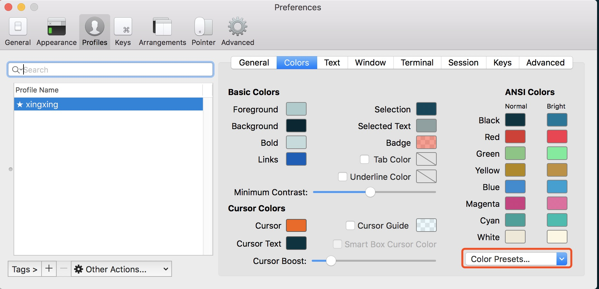
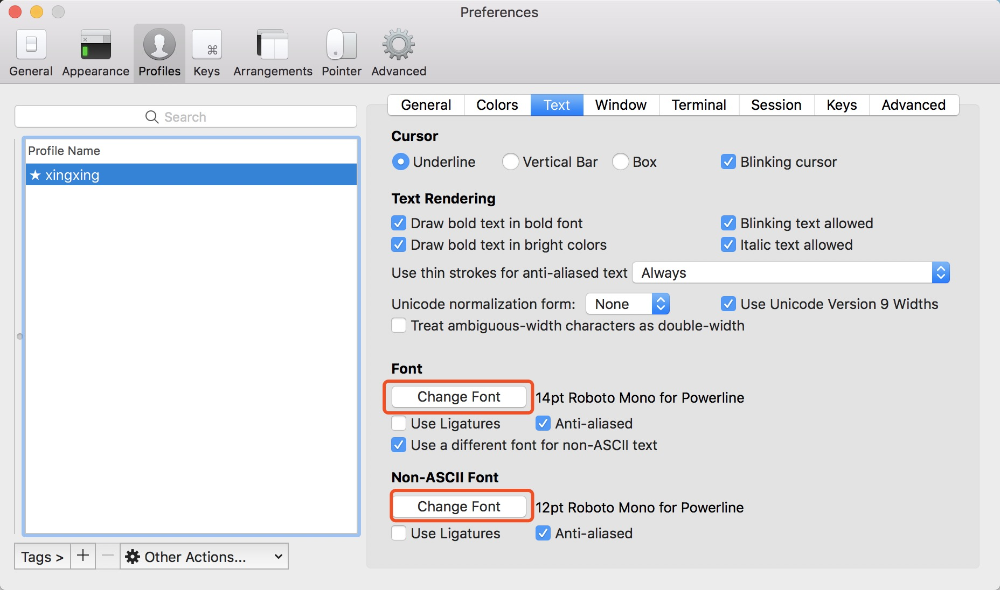
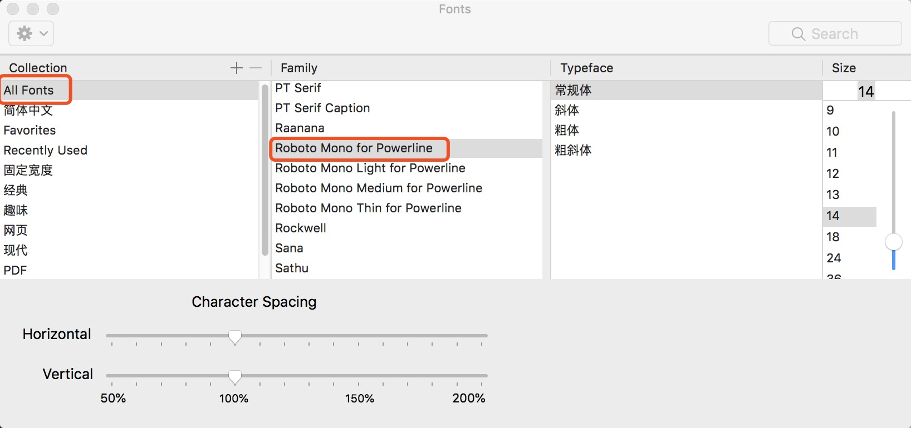
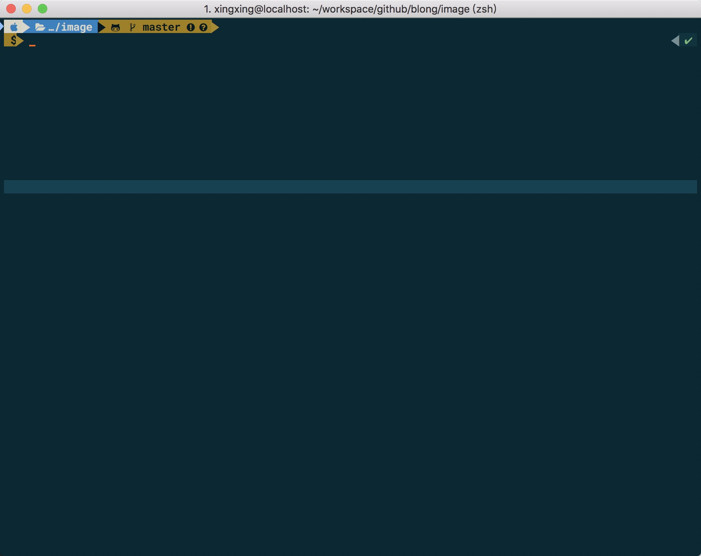

## mac使用iterm 
 
### 一、安装
 
 [https://www.iterm2.com/]()
 
    1. 安装iterm2 
    2. 使用oh-my-zsh 
    wget https://github.com/robbyrussell/oh-my-zsh/raw/master/tools/install.sh -O - | sh 
    3. cp ~/.oh-my-zsh/templates/zshrc.zsh-template ~/.zshrc
    4. vim ~/.zshrc
     ZSH_THEME="robbyrussell"  默认主题

  [https://github.com/robbyrussell/oh-my-zsh/wiki/Themes]() 每个主题的说明
  
    主题文件在  ~/.oh-my-zsh/themes
    
    
    编辑这个主题
    vim ~/.oh-my-zsh/themes/robbyrussell.zsh-theme
    
    修改这段
    PROMPT='${ret_status} %{$fg[cyan]%}%c%{$reset_color%} $(git_prompt_info)'
    在后面加了一个“>”， 其中%c 修改d 显示的是目录
    修改为
    PROMPT='${ret_status} %{$fg[cyan]%}%d%{$reset_color%} $(git_prompt_info)>' 
   
   
### 二 配置插件  
    安装插件
    autojump
    是一个命令行工具，它允许你可以直接跳到喜欢的目录  
    brew install autojump 
    
    
    
    修改.zshrc 
    [[ -s ~/.autojump/etc/profile.d/autojump.sh ]] && . ~/.autojump/etc/profile.d/autojump.sh
     
     
     
     自动提示命令
     zsh-autosuggestions 
     
     git clone git://github.com/zsh-users/zsh-autosuggestions $ZSH_CUSTOM/plugins/zsh-autosuggestions
     
     打开vim .zshrc  文件 
      plugins=(
         zsh-autosuggestions  git
      )
      
     打开终端之后，有些字体太淡了，修改
     cd ~/.oh-my-zsh/custom/plugins/zsh-autosuggestions  
     vim zsh-autosuggestions.zsh
     ZSH_AUTOSUGGEST_HIGHLIGHT_STYLE='fg=10'
     
     
     ls
      Mac OS X是基于 FreeBSD 的，所以一些工具 ls, top 等都是 BSD 那一套，ls 不是 GNU ls，所以即使 Terminal/iTerm2 配置了颜色，但是在 Mac 上敲入 ls 命令也不会显示高亮，可以通过安装 coreutils 解决
     
     brew install coreutils
      
    
     
     
    zsh-syntax-highlighting 
    语法高亮
     brew install zsh-syntax-highlighting

     vim .zshrc  
     source /usr/local/share/zsh-syntax-highlighting/zsh-syntax-highlighting.zsh
     
     自定义别名
     vim  ~.zshrc  
     alias cls='clear'
	  alias ll='ls -l'
     alias la='ls -a'
     alias vi='vim'
     alias grep="grep --color=auto"
   
    
### 配色 
   
   [https://iterm2colorschemes.com/]() 
     
     1. 下载
       git clone https://github.com/mbadolato/iTerm2-Color-Schemes.git
     
     2.导入  
     iterm2 -> preferences -> profiles -> colors
   
     
     选择import 导入下载下来的颜色schemes或者下载对应的xxx.itermcolors 文件导入即可
     
     
     可以选择自己喜欢的颜色了
     
       
     
     
     
     ssh  替换为mosh  
     brew install mobile-shell      
   
### 主题
     powerlevel9k 主题安装
   [https://github.com/bhilburn/powerlevel9k]()
   
    git clone https://github.com/bhilburn/powerlevel9k.git ~/.oh-my-zsh/custom/themes/powerlevel9k
    
    vim  ~/.zshrc: 
    
    ZSH_THEME="powerlevel9k/powerlevel9k"
    
   
    乱码解决
    安装powerline-fonts 
    # clone
     git clone https://github.com/powerline/fonts.git --depth=1
    # install
     cd fonts
     ./install.sh
    # clean-up a bit
     cd ..
     rm -rf fonts
    
    选择字体 
   
    
    设置字体
    
   
    
    
    安装awesome 字体
  [(https://github.com/gabrielelana/awesome-terminal-fonts/wiki/OS-X]()
    
    
    
   
    vim ~/.zshrc 
    
    追加在后面
    POWERLEVEL9K_PROMPT_ON_NEWLINE=true
    POWERLEVEL9K_RPROMPT_ON_NEWLINE=true

    POWERLEVEL9K_MODE='awesome-fontconfig'
    POWERLEVEL9K_SHORTEN_DIR_LENGTH=1
    POWERLEVEL9K_LEFT_PROMPT_ELEMENTS=(os_icon dir vcs)
    POWERLEVEL9K_RIGHT_PROMPT_ELEMENTS=(status)

    POWERLEVEL9K_OS_ICON_BACKGROUND="white"
    POWERLEVEL9K_OS_ICON_FOREGROUND="blue"
    POWERLEVEL9K_DIR_HOME_FOREGROUND="white"
    POWERLEVEL9K_DIR_HOME_SUBFOLDER_FOREGROUND="white"
    POWERLEVEL9K_DIR_DEFAULT_FOREGROUND="white" 
    	
	
	
    POWERLEVEL9K_MULTILINE_FIRST_PROMPT_PREFIX="%f"
    local user_symbol="$"
    if [[ $(print -P "%#") =~ "#" ]]; then
    user_symbol = "#"
    fi
    POWERLEVEL9K_MULTILINE_LAST_PROMPT_PREFIX="%{%B%F{black}%K{yellow}%} $user_symbol%{%b%f%k%F{yellow}%} %"
     
     
    效果如下
   
   
    但是每次登陆需要source ~/.zshrc
  
    具体参数参考
   [https://github.com/bhilburn/powerlevel9k]()
   
   [https://github.com/bhilburn/powerlevel9k/wiki/Stylizing-Your-Prompt]()
   
   [https://github.com/bhilburn/powerlevel9k/wiki/Troubleshooting]()
   
   
   
   